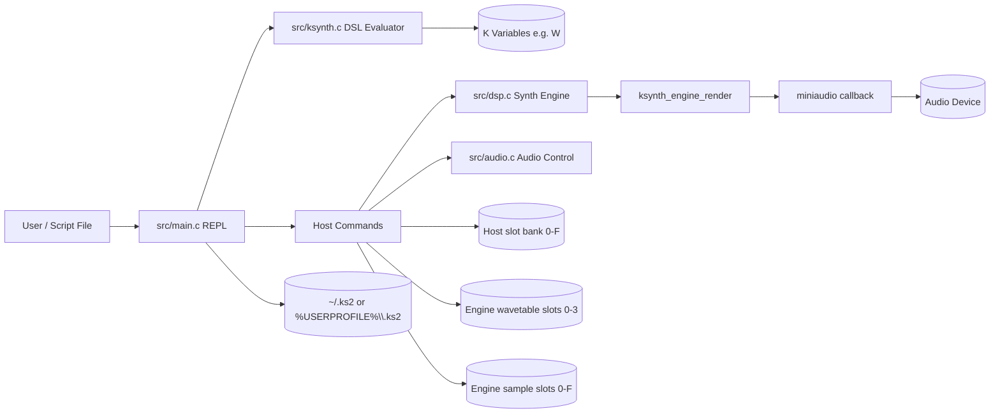
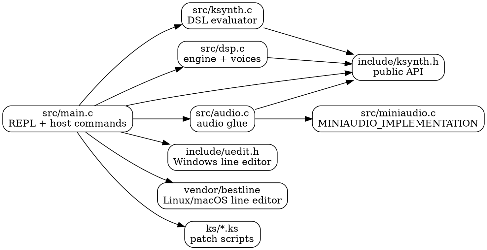
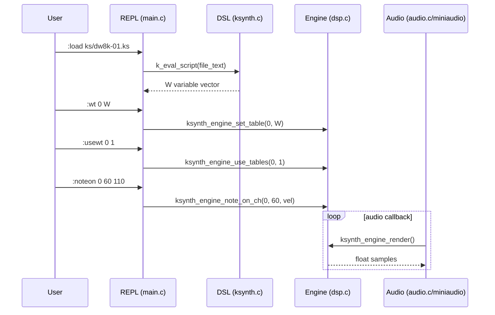
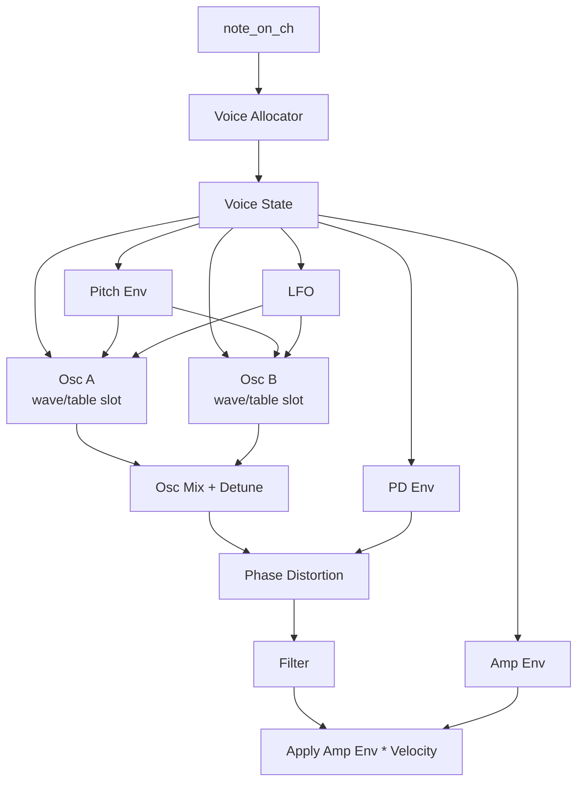

# KS2 Architecture

## Purpose

This document describes the current synthesizer/runtime architecture and key control/data flows.

Use this with:

- `STATUS.md` for current command/capability snapshot
- `CHANGELOG.md` for chronological evolution
- `DEVELOPING.md` for workflow and tooling setup

## High-Level System Map (Mermaid)

## Runtime Layers

1. DSL layer (`src/ksynth.c`)
- Evaluates KSynth expressions and scripts.
- Produces vectors (`K`) used as wavetable/sample source data.

2. Host/REPL layer (`src/main.c`)
- Parses `:` commands and maps them to engine APIs.
- Handles history, script execution, and interrupt behavior.

3. DSP/Engine layer (`src/dsp.c`)
- Voice allocation/rendering.
- Wavetable + sample playback.
- Envelopes, modulation, filter, channel mode, mono/poly, glide.

4. Audio I/O layer (`src/audio.c`, `src/miniaudio.c`, `vendor/miniaudio/miniaudio.h`)
- Real-time callback and device output.

## Module Relationships (Graphviz)

## Command Path: Wavetable Voice (Mermaid Sequence)

## Voice Architecture (Mermaid)

## Channel/Performance Model

- 16 logical channels (`0..F` from REPL commands).
- Per-channel mode:
  - `poly`: independent note-triggered voice allocation.
  - `mono`: one active voice + note stack.
- Mono glide (`:glide <ch> <ms>`) sets portamento/glissando time.
- Current event API (pre-MIDI integration):
  - `ksynth_engine_note_on_ch(channel, note, velocity)`
  - `ksynth_engine_note_off_ch(channel, note)`

## Transport + Interrupt Behavior

- Sequencer transport starts stopped by default.
- `:start` / `:stop` control transport state.
- `Ctrl-C` policy:
  - first press: warn + silence active voices
  - second press: exit cleanly

## Data Banking Model

- Host banks (REPL-visible): `0..F`, tracked as wavetable/sample kind for user-facing management.
- Engine wavetable slots: `0..3` (for oscillator table routing).
- Engine sample slots: `0..F` (sample playback voices).

## Current Design Tradeoffs

- Rich engine modulation can color wavetable audition (`:playwt`) by design.
- `:playwtraw` exists for cleaner oscillator/table audition.
- Wavetable and sample workflows coexist in one runtime path, but deeper unification remains ongoing.

## Known Evolution Targets

- MIDI adapter layer on top of existing channel event API.
- Larger/dynamic voice counts beyond current fixed caps.
- Multi-synth personality modes (DW/CZ/ESQ/PPG style control surfaces).
- More explicit routing/state inspection commands (e.g., channel state introspection).
